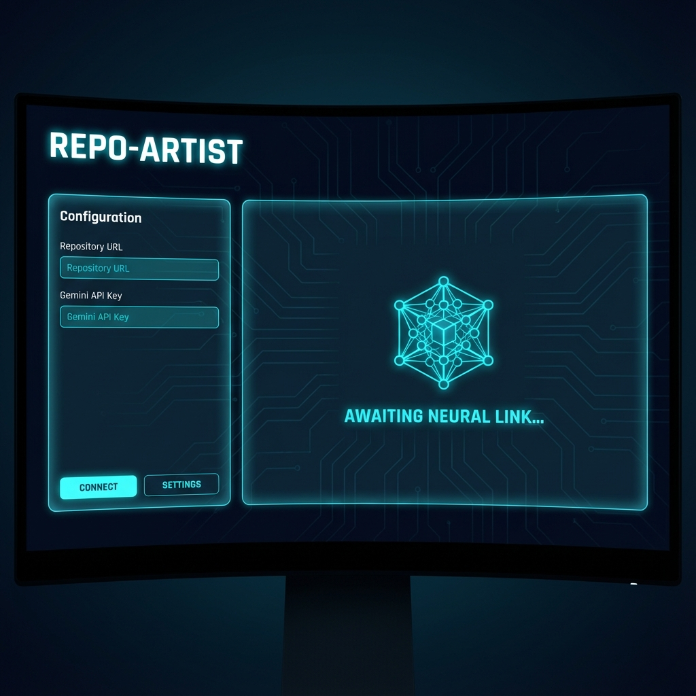

# Repo-Artist


**Automated Architecture Hero Image Generator for GitHub Repositories.**

Repo-Artist analyzes your codebase using **Google Gemini** to understand your architecture, then generates a high-end, sci-fi isometric "Hero Image" for your project.


## Features

- **AI-Powered Analysis**: Uses Gemini to analyze your code structure and infer architecture components.
- **Interactive Refinement**: Modify generated images using natural language (e.g., "Make the database red", "Add cloud icons").
- **Persistent Architecture Caching**: Saves architecture analysis to `repo-artist-architecture.json` for faster subsequent runs.
- **Smart Caching**: Architecture analysis is cached to avoid unnecessary LLM calls.
- **Configurable Model**: Choose which Gemini model to use via environment variable.
- **Smart Detection**: Only generates new art when significant changes are detected (> 3 files or > 50 lines).
- **CI Integration**: Runs on `git push` via GitHub Actions when `[GEN_ART]` tag is present.

## Installation

1. Clone the repository.
2. Install dependencies:
    ```bash
    pip install -r requirements.txt
    ```

## Web App & Setup

The easiest way to get started is the **Setup Wizard**, which configuring your keys and launches the Web UI.

1. **Run the Setup Wizard**:
   ```bash
   python scripts/repo_artist_setup.py
   ```
2. **Follow the Prompts**:
   - It will guide you to create a **GitHub OAuth App** (required for the web interface).
   - Enter your Client ID, Client Secret, and Gemini API Key.
   - It will automatically save them to `.env` and start the server.

3. **Use the Web App**:
   - **Preview**: Enter a Repo URL to see the architecture hero image.
   - **Refine**: Use natural language to modify the image ("Make it more colorful", "Add cloud icons").
   - **Apply**: Click to commit the image and README update directly to GitHub.

### GUI Preview




## CLI Usage (Recommended)

The easiest way to use Repo-Artist is via the CLI. There is no need to manually edit files.

```bash
# 1. Generate Architecture Diagram
python scripts/cli.py generate

# If GEMINI_API_KEY is missing, the tool will ask for it interactively
# and offer to save it to your .env file.
```

### Options

```bash
# Point to a different repo
python scripts/cli.py generate --path /path/to/other/repo

# Use Mermaid diagrams (no image generation, just structure)
python scripts/cli.py generate --mode mermaid

# Force refresh of the architecture analysis (ignore cache)
python scripts/cli.py generate --refresh-architecture

# Custom style variation
python scripts/cli.py generate --hero-style "cyberpunk neon"
```

### 🤝 GitHub Actions / CI (Advanced)

To enable automatic updates on `git push`, set up the GitHub Action:

```bash
python scripts/cli.py setup-ci
```

This command will:
1. Create `.github/workflows/generate_art.yml`
2. Automatically detect `gh` CLI and offer to upload your `GEMINI_API_KEY` to GitHub Secrets.

## Configuration

### Environment Variables

| Variable | Required | Default | Description |
|----------|----------|---------|-------------|
| `GEMINI_API_KEY` | Yes | - | Google AI API key for architecture analysis |
| `ARCH_MODEL_NAME` | No | `gemini-2.5-flash` | Gemini model to use for analysis |

### Caching

- **Persistent Architecture JSON**: `repo-artist-architecture.json` – Saved in repository root, reused across runs
- **Local Architecture cache**: `assets/architecture.json` – Stores the analyzed architecture JSON
- **Image cache**: `assets/architecture_diagram.png` – Generated hero image

To bypass caching:
- **Web UI**: Check "Force re-analyze (ignore cached architecture)" checkbox
- **CLI**: `--refresh-architecture` – Forces new LLM call, overwrites `architecture.json`

## Advanced Usage

### Local Trigger via Smart Push

Use the wrapper script to conditionally trigger generation before pushing:

```bash
python smart_push.py origin main
```

If significant changes are detected, it will offer options to refresh the art before pushing.
